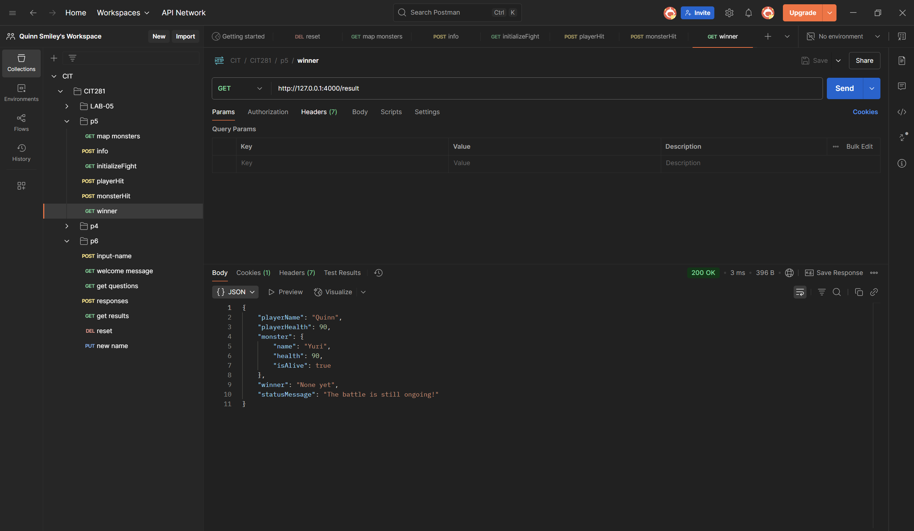

Project 05  
This project focused on creating some type of a game using a JavaScript class, a web server, a client program, and separate code modules. I chose to create a monster game that allowed for the player and the monster to hit one another and impact each of their health. 

